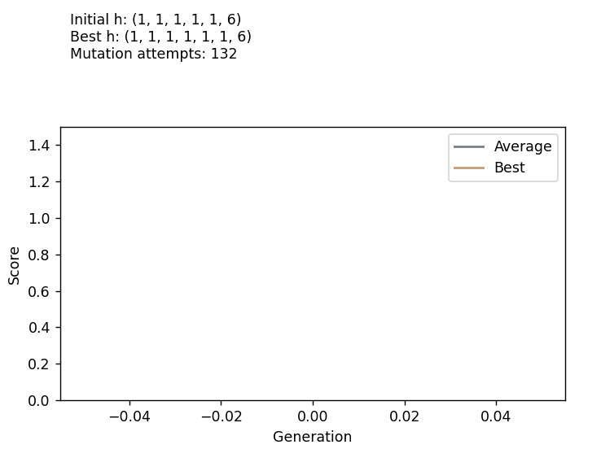

# genetic-search

Supporting code for the paper "_A genetic algorithm to search the space of Ehrhart h∗-vectors_" [(arXiv)](https://arxiv.org/abs/2309.16848). 
It includes the implementation of the genetic algorithm described in the paper, used to find the mentioned counterexample.

  

## Installation

To install the required dependencies, run:

`pip install -r requirements.txt`

## Usage

To use the genetic algorithm, simply run the `genetic_search.py` script with the appropriate arguments. For example:

`python genetic_search.py`
